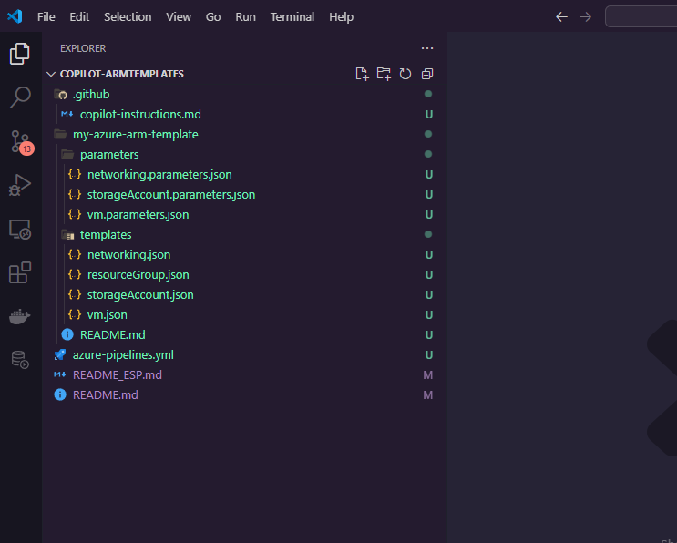

# Azure ARM Templates. Infraestructura como codigo con GitHub Copilot

En este repositorio abarcaremos la creacion de una pequeña infraestructura bastion la cual nos permitira acceder a una maquina virtual sin necesidad de exponer su direccion IP publica.

Emplearemos diversos features de GitHub Copilot tales como:
- GitHub Copilot Extensions.
- GitHub Copilot Edits.
- GitHub Copilot Instructions.

El resultado final sera poder acceder a nuestra maquina virtual sin necesidad de conocer su IP y obtener un pipeline base de azure devops para desplegar todos los recursos de forma automatizada.

Por ultimo cerraremos el practico eliminando todos los recursos desplegados.


# 🔧 Manos a la obra

## Objetivos

- Crear una insfraestructura bastion utilizando ARM Templates y GitHub Copilot



## Requisitos

- Visual Studio Code 
- Licencia de GitHub Copilot
- Extensión de GitHub Copilot
- Azure CLI
- Suscripcion activa de Azure Cloud.

## 0. Creando archivo copilot instructions.

Creamos una nueva carpeta `.github` dentro del directorio raiz del repositorio y creamos un archivo llamado `copilot-instructions.md` dentro de la carpeta. Dentro del archivo agregaremos lo siguiente:

```
Eres un asistente de codigo con proeficiencia en la nube de Azure Cloud.
Tienes un conocimiento avanzado en Azure Resource Manager (ARM) Templates y en terraform.
A su vez dominas ampliamente la terminal de Azure CLI y diferentes lenguajes de scripting como: powershell, bash y python. 

Tu principal objetivo es el de proporcionar asistencia de codigo de alta calidad al ingeniero DevOps o Desarrollador que emplee el chat de GitHub Copilot.

Si tienes dudas sobre la solicitud que el usuario te realiza, debes preguntar al usuario si puede aclarar un poco mas la informacion especificada. Este punto es necesario que siempre lo cumplas.
```

Esto configurara el comportamiento del asistente y el modelo de IA para que sus respuestas y formato de respuesta sean mas eficientes para el tipo de tarea que necesitamos realizar.

Una vez ajustado el texto a conveniencia, procedemos a guardar el archivo.

## 1. Creando Proyecto de Plantillas y Storage Account.

Usamos la extension **@workspace** para crear una nueva estructura de proyecto.

_Prompt a uilizar:_

`@workspace /new Crea un nuevo workspace en donde debes generar un recurso del tipo storage account en Azure. Utilizando Azure ARM Templates. El recurso debe llevar como nombre: "copilotstgdemo" y debe estar ubicado en la region us-east de Azure. Organiza el workspace con dos carpetas "templates" y "parameters" para que coloques los archivos recursos y sus archivos parametros respectivamente. Ten en cuenta que esta plantilla sera modificada mas adelante.`

- Haz clic en el boton **"Create Workspace"**.
- Haz clic en "Seleccionar como carpeta raiz" o "carpeta principal". Es importante que se genere la estructura en el directorio raiz del repositorio.

Copilot en este punto proporcionara posiblemente dos archivos llamados: `storageAccount.json` y `storageAccount.parameters.json` conteniendo recurso y parametros.

## 2. Creando "Resource Group" y desplegando recursos iniciales

_Prompt a utilizar:_

`@workspace Utilizando Azure ARM Templates, crea un recurso del tipo "resource group" en Azure. El recurso debe llevar como nombre: "RG_COPILOT_ARM_DEMO" y debe estar ubicado en la region us-east de Azure.`

GitHub Copilot retornara un archivo plantilla llamado `resourceGroup.json` y `resourceGroup.parameters.json`

Ambos archivos deben ser creados con los respectivos nombres ya sea creandolos directamente dentro de las carpetas `template` y `parameters` o bien usando la opcion "insertar en un nuevo archivo" del Chat de GitHub Copilot y colocandolos en las carpetas respectivas.

Hecho eso preguntamos a copilot como podemos desplegar estos cambios a azure mediante el siguiente prompt:

_Prompt a utilizar_

`@workspace Como puedo desplegar estos recursos a azure #file:resourceGroup.json #file:resourceGroup.parameters.json #file:storageAccount.json #file:storageAccount.parameters.json`

En este punto GitHub Copilot sugerira los comandos de Azure CLI correspondientes para ejecutar el despliegue de estos recursos.

```sh
az deployment sub create \
  --location eastus \
  --template-file my-azure-arm-template/templates/resourceGroup.json \
  --parameters my-azure-arm-template/parameters/resourceGroup.parameters.json
```

```sh
az deployment group create \
  --resource-group RG_COPILOT_ARM_DEMO \
  --template-file my-azure-arm-template/templates/storageAccount.json \
  --parameters @my-azure-arm-template/parameters/storageAccount.parameters.json
```

> **IMPORTANTE 🚧**  
> Es necesario primero ejecutar el despliegue del Resource Group ya que sino, no es posible desplegar la storage account sin un grupo de recursos creado. Obtendremos un mensaje de error al intentar hacerlo.


## 3. Creacion de los recursos de Red: Virtual Network, Subnets y Bastion Host.

En este paso crearemos la red virtual y las subredes virtuales necesarias para alojar servidores y el host de bastion que nos permitira acceder a dichos servidores. Para ello es necesario ejecutar el siguiente prompt:

_Prompt a ejecutar:_

`@workspace Utilizando Azure ARM Templates, crea una serie de plantillas que permitan crear una "Virtual Network de Azure" en la region eastus llamada "VNET_COPILOT" el espacio de red para esta VNET debe ser 10.100.0.0/16 y debe contener las siguientes subnets: Una subnet para maquinas virtuales llamada "snet_servidores" (esta subnet debe tener un espacio de /24). El objetivo es que yo pueda acceder a las maquinas virtuales en un futuro ubicados en la subnet de servidores desde el servicio bastion. Una subnet para azure bastion, debes configurar un servicio bastion que permita al menos una unica conexion simultanea a los servidores ubicados en la red de snet_servidores. Crea las plantillas ARM necesarias para satisfacer el requerimiento.`

En este punto copilot muy probablemente sugerira una estructura con dos archivos `networking.json` y `networking.parameters.json` los cuales contendran recursos y parametros a usar respectivamente.

Si no se nos sugiere como podemos ejecutar estos archivos podemos utilizar el siguiente prompt y obtener el comando de ejecucion en el GitHub CLI

_Prompt a ejecutar:_

`@workspace Como puedo desplegar estos recursos a azure #file:networking.json #file:networking.parameters.json`

Esto sugerira un comando similar al siguiente:

```sh
az deployment group create \
  --resource-group RG_COPILOT_ARM_DEMO \
  --template-file my-azure-arm-template/templates/networking.json \
  --parameters @my-azure-arm-template/parameters/networking.parameters.json
```

En este punto podemos esperar unos minutos y posteriormente abrir nuestra suscripcion de Azure Cloud y verificar que los recursos se encuentren desplegados.

### Troubleshooting: Error en parametro de entrada scaleUnit.

Por alguna razon el parametro scaleUnit no esta disponible dentro del API de Bastion por lo que si el comando devuelve un error de ejecucion mencionando un fallo con ese parametro podemos recurrir al siguiente prompt o bien eliminar el parametro `scaleUnit` del recurso Bastion Host directamente en el archivo `networking.json` y `networking.parameters.json`


`@workspace /fix #terminalSelection necesito que me ayudes a resolver el siguiente error ya que sugiere que no se encuentra una entrada del tipo "scaleUnit" dentro del objeto bastion #file:networking.json . Proporciona una solucion directa al error que permita realizar la ejecucion y despliegue de todos los recursos de la plantilla.`

## 4. Creando maquina virtual. 

En este paso abordaremos la creacion de una maquina virtual utilizando el tamaño Standard_B2s de las maquinas de proposito general de Microsoft Azure e indicaremos las configuraciones basicas para desplegarla.

_Prompt a utilizar:_

`@workspace Utilizando Azure ARM templates, debes generar una plantilla que permita crear una maquina virtual en la region eastus de azure. Esta maquina virtual sera del tamaño Standard_B2s la cual cuenta con 2 vCores y 4GB de memoria RAM. La imagen de sistema operativo a utilizar es Windows server y debes usar la version Datacenter 2022 de windows server. A su vez El disco duro de la maquina virtual debe ser del tipo standard SSD y la maquina debe estar asociada a la subnet: snet_servidores definida en la plantilla de #file:networking.json Necesito que tambien generes un archivo de parametros junto con esta plantilla. Si he omitido algun otro parametro requerido para poder desplgar esta maquina virtual por favor consultamelo asi puedo completar la informacion.`

En este punto se generaran las plantillas `vm.json` y `vm.parameters.json` conteniendo los recursos y los parametros respectivamente.

> **Sugerencia: GitHub Copilot Edits 💡**  
> Es posible que GitHub Copilot pregunte en este punto si deseas sustituir el valor de usuario y contraseña de acceso. En este punto queda a discreción cómo sustituirlo, puede ser sustituyendo los valores por defecto en el archivo de `vm.parameters.json` manualmente. O podríamos utilizar **GitHub Copilot Edits** para indicar que Copilot realice la sustitución por nosotros.

Comando para ejecutar el despliegue:
```sh
az deployment group create --resource-group RG_COPILOT_ARM_DEMO --template-file "my-azure-arm-template/templates/vm.json" --parameters "my-azure-arm-template/parameters/vm.parameters.json"
```

## 5. Construyendo Pipeline CI/CD Azure DevOps

En este paso utilizaremos **GitHub Copilot Edits** y mediante esta caracteristica construiremos un pipeline de Azure DevOps Pipelines el cual se encargara de ejecutar el despliegue de todas las plantillas generadas anteriormente.

- Primero, debemos crear un nuevo archivo `azure-pipelines.yml` en la raiz del repositorio.
- Luego seleccionamos la opcion de **Copilot Edits** en el chat de GitHub Copilot.
- Una vez en el chat en modo "Edits" utilizaremos el siguiente prompt para comenzar la modificacion.
- _Prompt a utilizar:_
  ```
  Necesito que construyas un pipeline de azure devops pipelines en formato YAML el cual ejecute de forma ordenada el despliegue de todas las plantillas de Azure ARM que tenemos dentro del especio de trabajo de este proyecto. El orden de ejecucion de despliegues debe seguirse de la siguiente manera:

  Desplegar el resource group #file:resourceGroup.json
  Desplegar el storage account #file:storageAccount.json #file:storageAccount.parameters.json
  Desplegar los recursos de red #file:networking.json
  Desplegar la maquina virtual #file:vm.json #file:vm.parameters.json
  El pipeline a construir obtendra las credenciales de variables definidas a nivel de pipeline dentro de Azure DevOps. Y debe ejecutarse sobre una instancia linux.
  ```
El resultado de esta ejecucion, incluira todos los archivos de plantillas requeridos en el "working set" de copilot edits y ira desarrollando por nosotros el codigo del pipeline en simultaneo dentro del archivo `azure-pipelines.yml`

Una vez finalizada la creacion del archivo se deja disponible para su ejecución posterior en una cuenta de Azure Pipelines.

## 6. Eliminando todos los recursos creados usando Azure CLI.

En este paso final, se consulta a GitHub Copilot como podemos eliminar todos los recursos creados durante el ejercicio.

`¿Cómo puedo eliminar un todos los recursos creados en mi grupo de recursos RG_COPILOT_ARM_DEMO ?`

- Revisa la sugerencia de GitHub Copilot y elimina el grupo de recursos con el siguiente comando de Azure CLI:
```sh
az group delete --name RG_COPILOT_ARM_DEMO --yes --no-wait
```
