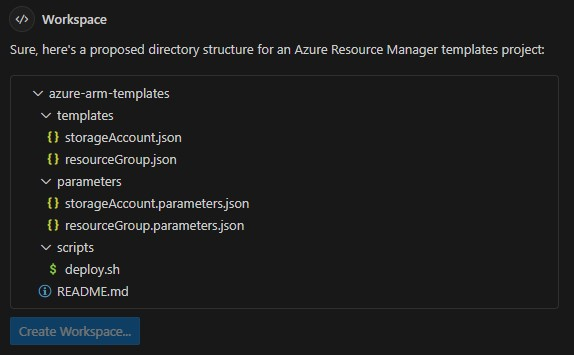

# COPILOT con ARM Templates para Aprovisionamiento en Azure

Este repositorio fue creado para el programa de adopción de GitHub Copilot, específicamente para ARM Templates Hands-On.

# Primera Actividad: Crea tu Workspace y Proyecto con VS Code y ARM Templates

- VS Code y ARM Templates

## Objetivos

- Crear un proyecto de ARM Templates desde cero usando GitHub Copilot.



## Requisitos

- VS Code
- Licencia de GitHub Copilot
- Extensión de GitHub Copilot
- Extensión de GitHub Copilot CLI
- Azure CLI
- Suscripción de Azure

## Paso 1: Crear un Proyecto de ARM Templates

> @workspace /new Necesito crear un workspace de Azure Resource Manager templates para crear una cuenta de almacenamiento dentro de un grupo de recursos de Azure. Más adelante agregaré más ARM Templates para continuar aprovisionando recursos.

- Haz clic en "Create Workspace".

### Solución de Problemas

- Los archivos ".json" de ARM Templates pueden variar porque estamos trabajando con gen-ai. Si tienes problemas, usa los siguientes archivos.

- storageAccount.json
```json
{
  "$schema": "https://schema.management.azure.com/schemas/2019-04-01/deploymentTemplate.json#",
  "contentVersion": "1.0.0.0",
  "parameters": {
    "storageAccountName": {
      "type": "string",
      "metadata": {
        "description": "El nombre de la cuenta de almacenamiento."
      }
    },
    "location": {
      "type": "string",
      "metadata": {
        "description": "La ubicación donde se creará la cuenta de almacenamiento."
      }
    },
    "StorageAccountType": {
      "type": "string",
      "defaultValue": "Standard_LRS",
      "allowedValues": [
        "Standard_LRS",
        "Standard_GRS",
        "Standard_RAGRS",
        "Premium_LRS",
        "Premium_ZRS"
      ],
      "metadata": {
        "description": "El tipo de cuenta de almacenamiento."
      }
    }
  },
  "resources": [
    {
      "type": "Microsoft.Storage/storageAccounts",
      "apiVersion": "2019-06-01",
      "name": "[parameters('storageAccountName')]",
      "location": "[parameters('location')]",
      "sku": {
        "name": "[parameters('storageAccountType')]"
      },
      "kind": "StorageV2",
      "properties": {
        "supportsHttpsTrafficOnly": true
      }
    }
  ]
}
```

- storageAccount.parameters.json
```json
{
  "$schema": "https://schema.management.azure.com/schemas/2019-04-01/deploymentParameters.json#",
  "contentVersion": "1.0.0.0",
  "parameters": {
    "storageAccountName": {
      "value": "myarmstorageaccount"
    },
    "storageAccountType": {
      "value": "Standard_GRS"
    },
    "location": {
      "value": "eastus"
    }
  }
}
```

## Paso 2: Pregunta a Copilot Chat cómo cambiar el tipo de cuenta de almacenamiento

> ¿Cómo puedo actualizar el tipo de mi cuenta de almacenamiento ya creada a "Standard_GRS" usando ARM Templates?

- Revisa el ".json" generado, aplica los cambios sugeridos y actualiza la cuenta de almacenamiento con el siguiente comando de Azure CLI:
```terminal
az deployment group create --resource-group <resource-group-name> --template-file ./storageAccount.json --parameters @./storageAccount.parameters.json
```

## Paso 3: Pregunta a Copilot Chat por un ARM Template para crear una VNet y Subnet

> Ahora necesito crear una Azure VNet con su subnet por defecto usando un ARM Template. ¿Puedes sugerirme un ".json" para lograr esto?

- Revisa la sugerencia de Copilot Chat y sigue los pasos indicados.

## Paso 4: Pregunta a Copilot Chat cómo modificar la Subnet de la VNet ya creada

> ¿Cómo puedo actualizar mi VNet ya creada con ARM Templates para agregar otra Subnet dentro del mismo rango de direcciones IP permitido?

- Revisa la sugerencia generada y actualiza los archivos ".json" de la VNet.

## Paso 5: Pregunta a Copilot Chat cómo eliminar una Subnet de la VNet con ARM Templates

> ¿Cómo puedo eliminar con ARM Templates una de las subnets ya creadas en mi Azure VNet?

- Revisa la sugerencia generada y actualiza los archivos ".json" de la VNet.

## Paso 6: Pregunta a Copilot Chat cómo eliminar un grupo de recursos en Azure

> ¿Cómo puedo eliminar un Azure Resource Group usando Azure CLI en mi terminal?

- Revisa la sugerencia de GitHub Copilot y elimina el grupo de recursos con el siguiente comando de Azure CLI:
```terminal
az group delete --name myResourceGroup --yes --no-wait
